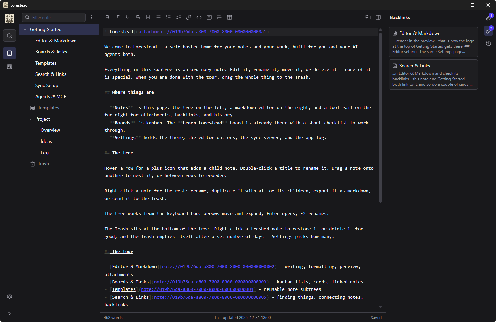

# Lorestead

Lorestead is a notes and tasks app designed for modern workflows, with built-in MCP servers for working with AI agents. It's free and open source, runs on Windows, macOS, and Linux, and comes with a self-hostable sync server.



## Features

- **Notes** - markdown notes in a tree, where any note can hold child notes
- **Editor** - markdown editor with a toolbar, side-by-side preview, and find and replace
- **Templates** - create a note or a whole note tree from a template
- **Links** - notes link to each other and survive renames; a backlinks panel shows what points at the current note
- **Tasks** - kanban boards with drag and drop; tasks hold descriptions, attachments, and linked notes
- **Search** - one `Ctrl+K` dialog with full-text search across notes, tasks, boards, and settings
- **History** - past versions of every note, with diff and restore
- **Attachments** - files and images on notes and tasks
- **Sync** - optional self-hostable sync server; the server database is encrypted at rest
- **Import and export** - plain markdown in and out; reads Obsidian vaults and Joplin exports, writes files both can read
- **Agents** - MCP servers built in: stdio for local use, HTTP on the sync server, OAuth supported for cloud connectors
- **Live updates** - edits from agents and other devices appear in the app as they happen

## Why Lorestead

There are plenty of good notes apps. Lorestead is for people who want:
- Simplicity
- One app for both notes and tasks
- Their own sync server
- And AI agents that can work with them on their projects

Tasks link to the notes behind them, so a board card carries *context* without bloating your *context window*. The sync server is a single small container with everything inside it. Agents connect over MCP out of the box, and every edit, yours or an agent's, lands in history with diff and restore, so you can let an agent work without worrying about what it might overwrite.

If that's what you're looking for, Lorestead is a lightweight, clean, and private solution.

## Install

Download the latest release from the [releases page](https://github.com/rthomasv3/Lorestead/releases/latest).

- **Windows** - run `Lorestead-win-x64-Setup.exe`
  - SmartScreen or Defender may warn about the installer while the app is new and its signing certificate builds reputation. Every release is built and signed by this repo's [release workflow](.github/workflows/release.yml), so the whole trail from source to download can be audited.
- **macOS** - run `Lorestead-osx-arm64-Setup.pkg` (Apple Silicon)
- **Linux** - download `Lorestead-linux-x64.AppImage`, make it executable with `chmod +x`, and run it

Portable zips for Windows and macOS are on the same page. The app updates itself (AppImage updates in-place): check from Settings, or turn on auto-update and forget about it. No sync server is needed to use the app.

## Sync server

The sync server is a single Docker container. Images are on Docker Hub as `rthomasv3/lorestead-server` and on GHCR as `ghcr.io/rthomasv3/lorestead-server`.

### Docker Compose

```yaml
services:
  lorestead:
    image: rthomasv3/lorestead-server:latest
    ports:
      - "8080:8080"
    environment:
      LORESTEAD_TOKEN: change-me
      LORESTEAD_DB_KEY: change-me-too
    volumes:
      - lorestead-data:/data
    restart: unless-stopped

volumes:
  lorestead-data:
```

### Docker CLI

```bash
docker run -d \
  --name lorestead \
  -p 8080:8080 \
  -e LORESTEAD_TOKEN=change-me \
  -e LORESTEAD_DB_KEY=change-me-too \
  -v lorestead-data:/data \
  --restart unless-stopped \
  rthomasv3/lorestead-server:latest
```

### Options

All configuration is environment variables.

| Variable | Default | What it does |
|---|---|---|
| `LORESTEAD_TOKEN` | required | The token every device and agent authenticates with |
| `LORESTEAD_DB_KEY` | required | Encrypts the database at rest, so a copy of the volume is not a copy of your notes |
| `LORESTEAD_HISTORY_RETENTION` | `50` | Versions kept per note and task (10-100) |
| `LORESTEAD_PURGE_RETENTION_DAYS` | `90` | How long permanent deletions stay replayable, so offline devices still hear about them (1-3650) |
| `LORESTEAD_OAUTH_CLIENT_ID` | unset | Enables OAuth for cloud connectors; set together with the secret |
| `LORESTEAD_OAUTH_CLIENT_SECRET` | unset | The OAuth client secret; rotating it revokes every issued token |
| `LORESTEAD_PUBLIC_URL` | unset | The URL the server is reachable at from the internet; required when OAuth is set |
| `LORESTEAD_OAUTH_REDIRECT_URIS` | claude.ai and claude.com callbacks | Comma-separated list of allowed OAuth callback URLs |
| `LORESTEAD_DATA_DIR` | `/data` | Where the database lives; the image already sets this |

`openssl rand -base64 32` makes a good value for the token, the key, and the secret.

The server speaks plain HTTP, so run it behind a reverse proxy that handles TLS. Its whole state is the data volume; back that up and you have backed up everything.

To connect the app, open Settings, go to Sync Server, and enter the URL and token.

## AI agents (MCP)

Any MCP host - Claude Code, Claude Desktop, Codex, OpenCode, and others - can read and write your notes, tasks, and templates. There are two ways in, and both offer the same tools.

### Local

A binary named `Lorestead.Mcp` ships inside every install and talks straight to the database on your machine. No server needed.

- **Windows** - `%LocalAppData%\Lorestead\current\Lorestead.Mcp.exe`
- **macOS** - `/Applications/Lorestead.app/Contents/MacOS/Lorestead.Mcp`
- **Linux** - the AppImage itself: `Lorestead.AppImage --mcp`

For Claude Code, that is one command:

```bash
claude mcp add lorestead -- <path from above>
```

The app ships with a guide covering the other hosts, config snippets included, in its Getting Started notes.

### Over the sync server

The sync server serves the same tools at `/mcp`. Use it when the agent is not on the machine that holds your notes - a hosted assistant, a CI job, your phone. Hosts that can send an `Authorization` header use your deployment token. Claude on the web and mobile cannot, so they sign in with OAuth: add a custom connector pointing at `https://your-server/mcp` and enter the client id and secret from the options table above.

### What agents can and cannot do

Agents can search, walk the note tree, list recent changes, and read any note or task in full. They can create and update notes and tasks, append to a note, move tasks between columns, link notes to tasks, create templates and new notes from them, and read or add attachments. Search and listings return ids, titles, and snippets rather than whole bodies, so an agent finds the right note before spending context on it.

Agents cannot delete anything: there is no trash, purge, or restore tool. They also cannot move a note in the tree, unlink a note from a task, or remove an attachment, and boards and columns are yours to manage. Every agent edit lands in history under its own device name with `-mcp` on the end, so you can see exactly what an agent changed and put it back.

## Building from source

You need the .NET 10 SDK and Node.js 20.19+ or 22.12+.

**App** - from `src/Lorestead.Client`:

```bash
dotnet run -c Release
```

The Release build installs and builds the front end on its own; no separate step. The hot-reload setup for development is covered in [src/Lorestead.Client](src/Lorestead.Client/README.md).

**Server** - from `src/Lorestead.Server`:

```bash
dotnet run
```

Development values for the required variables come from launchSettings.json.

**Server image** - from the repo root:

```bash
docker build -t lorestead-server .
```

**Tests** - from the repo root:

```bash
dotnet test
```

The installers, AppImage, and signing are produced by the [release workflow](.github/workflows/release.yml) and the scripts under [build](build/).

## Status

The project is still somewhat new, but it's what I'm using daily for all my notes and tasks. The app is overall stable and working well, with minor polish and more features being the primary tasks on my board.

### TODO
1. **Mobile app** - A mobile app wasn't a release blocker for me because I don't take a lot of notes on my phone. And, if I need to, Claude is hooked up to my sync server via MCP. But I understand it's an important piece for many people, so it's on my list and currently under technical evaluation, with development hopefully starting soon.
2. **More board features** - The boards are simple by design, but a couple more features like labels and trash would be nice. I'll evaluate this more as I use it in my projects.
3. **UI polish** - There are a couple minor places where the UI/UX could use some polish. I'll be tackling these as they bug me (or you - just open an issue and let me know).

## License

Lorestead is MIT licensed - see [LICENSE.txt](LICENSE.txt). The licenses of everything it ships with are collected in [THIRD-PARTY-NOTICES.txt](THIRD-PARTY-NOTICES.txt).
